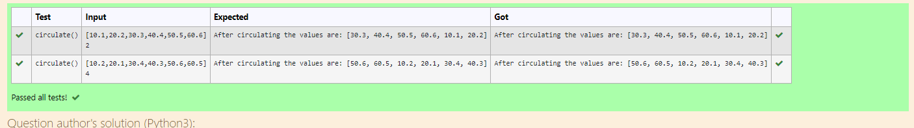

# Circulate-the-values-of-N-variables
## Aim:
To write a python program to circulate the n variables using function concept
## Equipment’s required:
PC
Anaconda - Python 3.7
## Algorithm: 
### Step 1: 
create a function for circulate
### Step 2: 
Get the input of list
### Step 3: 
Get the value from the user for the number of rotation
### Step 4: 
Using the slicing concept rotate the list
### Step 5: 
print the circulated list
### Step 6: 
call the function for execution

## Program:
```
#Program to circulate N values.
#Developed by: Praveen s
#RegisterNumber:22009017
def circulate():
    g=eval(input())
    n=int(input())
    rot=g[n:]+g[:n]
    print('After circulating the values are:',rot)
```

## Output:


## Result:
Thus the program executed sucessfully
